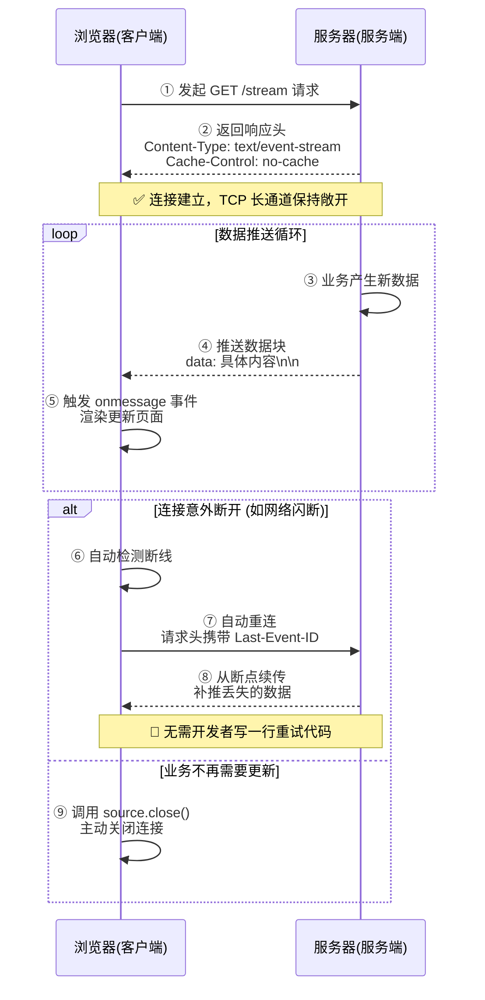

# SSE 流式输出

SSE(Server-Sent Events) 指的是网页自动获取来自服务器的更新。

以前也可能做到这一点，前提是网页不得不询问是否有可用的更新。通过服务器发送事件，更新能够自动到达。比如短轮询和长轮询。但是它们都非常的消耗资源，SSE 实现了即时请求。

---

SSE 并没有发明什么新协议，它巧妙地利用了 **HTTP/1.1 的长连接（Keep-Alive）** 和 **分块传输编码（Chunked Transfer Encoding）** 特性。客户端发起一次请求后，服务端不再返回完整的响应包，而是**保持 Socket 通道敞开**，每当有新数据生成，就通过这个通道“流式”地写出一段文本片段。

### 标准的数据格式

要实现 SSE，服务端必须在响应头中明确告诉浏览器：“接下来我要持续不断地给你推流了”。

```http
HTTP/1.1 200 OK
Content-Type: text/event-stream
Cache-Control: no-cache
Connection: keep-alive
```

一旦浏览器识别到 `Content-Type: text/event-stream`，它就不会关闭连接，而是进入等待接收状态。

后续传输的数据极其简洁，遵循固定的纯文本格式：

- `data:` 表示数据行（如果数据有多行，可以用多个 `data:` 拼接）。
- `id:` 表示本次事件的唯一ID（用于断线重连时的续传）。
- `retry:` 告诉浏览器如果断线了，隔多少毫秒重连。
- 一个**空行**代表本条消息的结束。

**举个例子**，服务器每隔一秒推一条“心跳”，数据包就长这样：

```text
data: 当前时间：2026-08-21 10:00:01

data: 当前时间：2026-08-21 10:00:02

```

### 浏览器端的接入

这是SSE相比WebSocket最“亲民”的地方。你不需要引入任何第三方库，浏览器原生就支持 `EventSource` API。

```javascript
// 1. 新建连接，只需传入接口地址
const source = new EventSource("/api/stream")

// 2. 监听默认的 message 事件，数据自动就来了
source.onmessage = function (event) {
  console.log("收到更新:", event.data)
  // 直接渲染到页面上，实现了“即时更新”
}

// 3. 监听错误（比如断网）
source.onerror = function () {
  console.log("连接断了，浏览器会自动尝试重连！")
}
```

### 断线自动重连与续传

这是长轮询永远无法比拟的。假设用户在电梯里网络闪断了 10 秒钟：

- **长轮询**：客户端会收到超时错误，必须由开发者写复杂的 `setTimeout` 和指数退避算法去重连，且重连后丢失了闪断期间的数据。
- **SSE**：浏览器底层会自动检测断线，并在 3 秒（默认）后发起新的请求。更绝的是，如果服务端在下发数据时携带了 `id: 100`，浏览器会在重连的请求头中自动加上 `Last-Event-ID: 100`。服务端接收到这个头，就知道客户端最后拿到的是第 100 条数据，直接从第 101 条开始补推。

### 用途

- **AI 大模型流式对话**（ChatGPT 的打字机效果）：每生成一些 Token 就立即通过 `data` 推给前端，用户看着字一个个蹦出来，体验极佳。
- **实时股票/币价行情**：不需要用户刷新页面，K线图随着推送实时跳动。
- **新闻/体育赛事实时弹窗**：后台编辑一发稿，所有在线读者的页面右下角立刻弹出推送。
- **后台任务进度条**：上传大文件或导出报表时，服务端持续推送 `进度: 45%`、`进度: 80%`。

### 缺陷

尽管SSE非常优雅，但它**不是万能药**，因为底层依然是 **HTTP 单工通道**。如果你的业务需要：

- **双向实时交互**（比如在线围棋对弈，落子后要立刻收到对手落子，同时自己也要能随时发送落子指令）；
- **极低延迟的二进制传输**（比如实时音频/视频流、MMORPG 游戏同步）；
- **需要服务端主动向客户端发送极高频消息**（每秒上千条）；

在这些场景下，SSE 的 HTTP 头开销和文本协议就会显得捉襟见肘，这时就得去拥抱 **WebSocket** 了。

---

**总结一下**：SSE 没有长轮询的重连痛点，也没有短轮询的资源浪费，它用最少的代码量、最低的服务器内存开销，完美解决了“单向实时推送”这个高频需求。如果把 WebSocket 比作高性能的“高速公路双向八车道”，那 SSE 就是一条专为“广播电台”设计的单向高速光纤——**专一、便宜、信号还特别好**。

---


